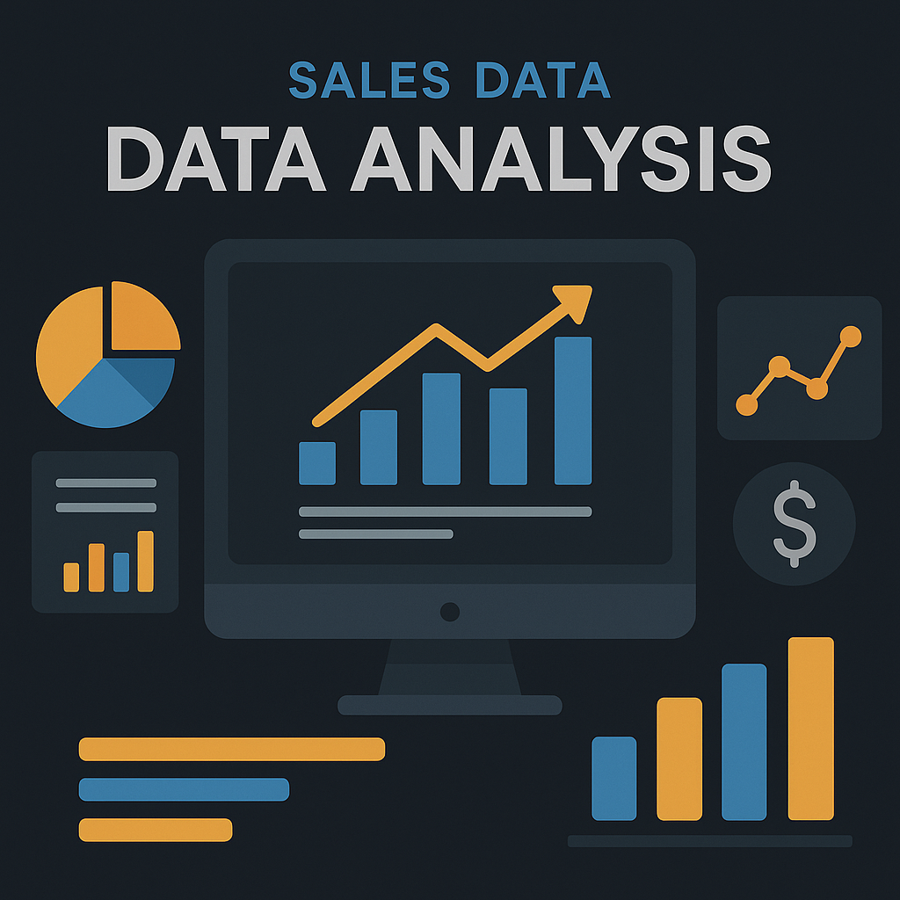

# Analyzing Amazon Electronics Sales Data with Python

   
    
   

  <h3 align="center">A Data Analyst Portfolio</h3> 

**This repository contains the code of My Data Analysis.**

## Description:

This project delves into the world of online electronics sales by analyzing a dataset from Amazon. Using Python libraries and guided by data science principles, we'll uncover valuable insights into customer behavior, product performance, and sales trends. This exploration will aid in understanding market dynamics and potentially inform strategic business decisions.

### Technologies:

Python (Data analysis and visualization)
Libraries: Pandas (Data manipulation), NumPy (Numerical computing), Matplotlib/Seaborn (Data visualization)

Follow me on LinkedIn : 

Follow me on Kaggle : )

Follow me on Instagram : 

Follow me on Github : 
